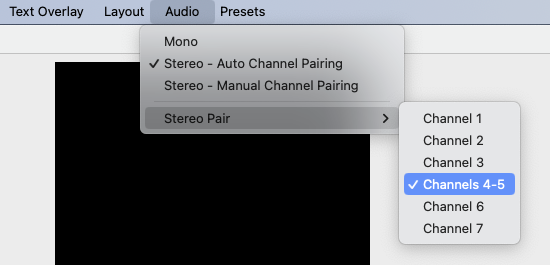
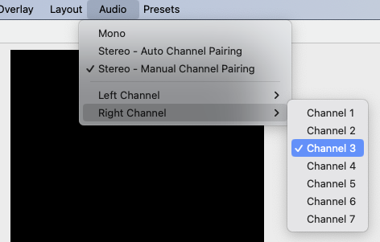

import Link from '@docusaurus/Link';

The `vrsplayer` app lets you "play" a VRS like a multi-stream video, with audio if an audio stream is present.

With the `vrsplayer` app, you can open VRS files that follow the `DataLayout` conventions described in the Image Support section.

## Playback Controls

To play/pause/stop playback, use the following controls.

The Previous and Next Frame buttons will play at most one frame backward or forward for each visible stream. The Speed controls let you choose to play slower or faster. Obviously, if there is too much data to process for your system, frames will be dropped.

## Overlay Selection

The overlay selector lets you choose what information to display over the frames. Choose "Hide" to show nothing, "Tags" to show streams tags, and "Configuration", "State" or "Data" to show the metadata found in the last record of that type.

Use the Text Overlay menubar options to control the color of the text, its font size, and whether the text is drawn on a solid background or not.

The `vrsplayer` app is improved regularly, so it's important to be able to discover functionality directly from the app's user interface. The following sections show less obvious features and controls.

## Tooltips

To know the duration of the image data, use the tooltip found over the time display.

Note that the start and end times show the time range in which image or audio data was found. Streams that don't contain image or audio data are ignored, and only data records from image and audio streams are considered. So if a recording contains a single image stream that has a configuration record at timestamp 0 rather than just before the first data record (as is too often the practice), while the first data record is at timestamp 15, the playback start time will be 15.

The tooltip shown over frames shows the stream's ID ("214-1"), the `RecordableTypeId` name ("RGB Camera Class"), its flavor (if any, here "device/aria"), and if a stream tag named `"device_type"` is found, the device type ("Simulated").

## Menu Bar Commands

The Menu Bar offers functionality that's easy to ignore, don't forget to look for more options there!

### Layout

The `Layout` menu lets you control the number rows and the number of streams shown per row. `Layout Frames 4x2` means using 2 rows with up to 4 streams each. The layout configurations offered depend on the number of image streams visible.

### Audio

If your file contains a VRS stream with audio data that contains more than one audio channel, the Audio menu will let you control which audio channel(s) to play. For instance, with an Aria file containing 7 audio channels, the audio menu might look like so:

In this situation, the Mono playback option was selected, so you can choose to play any of the 7 audio channels. If your system supports stereo playback (as most systems do), that channel will be played on both output channels. Use this option to listen to audio channels individually.

Assuming your system supports stereo playback, you can choose one of two stereo channel pairing modes: Auto Channel Pairing, and Manual Channel Pairing.

Auto Channel Pairing lets you select a first audio channel ("left"), and the next audio channel will automatically be used as the "right" channel. If that automatic selection is not what you need, use the Manual Channel Pairing option:

In this mode, you can select arbitrary channels for the "left" and "right" channel of your stereo playback.

### Presets

The `Presets` menu's top section lets you save and manage presets. Use the `Save Preset` command to save your favorite stream display and audio configurations, including stream orientation, stream order, and which streams are visible or hidden. To arrange the image streams, you can also use the options presented in the Context Menu section below.

Once at least one preset has been saved, you can recall or delete presets, which automatically get a keyboard shortcut for quick access.

## Context Menu

Control the rotation and orientation of each stream using the context menu shown when right-clicking on each stream. The same menu lets you reorder streams, by bumping the chosen stream up or down one position in the order. You can also hide streams from this context menu. The last option lets you save the visible frame as png or jpg file.

To unhide streams, use one of the `Layout` menu commands that appear once at least one stream has been hidden.

## Playback "fps" Display

Normal playback tries to flow at timestamp speed, and frames will be dropped easily at different stages if needed to keep up. At the bottom of each view, you will find an individual fps counter, with 3 parts:

- the first number (16) is the count of records read from disk per second. During playback, it should be the highest of all the counters. That step includes reading data from storage, lossless decompression, data interpretation and `StreamPlayer` callbacks processing. Reading files is a single threaded operation (as file APIs typically are), so this work is done by same thread for all streams, which is no decoding or conversion work is done on that thread.
- the second number (4) is the count of frames "decoded" per second. If images are encoded (jpg/png) they will be decoded. Then if the frames need to be transcoded to a different pixel format for display, they'll be converted to a Qt friendly pixel format. If processing is too expensive, frames might be skipped at that stage. That second number can only be equal or lower than the first. This processing is happening on a dedicated thread for each stream.
- the last number (2) is the "display" fps ("frames per second"), which is the number of times the code that draws the frame in the Qt widget is called each second. During playback, the number should be equal or lower than the second, but if you resize the windows, that number can go way up, as even if playback is paused and the two first are frozen, this counter will be updated as the window is updated. All draw operations happen in the app's single UI thread.

Putting it all together, for replay, one thread reads the files and extracts the raw image data, one thread draws the processed images in the user interface, but each stream has its own thread to do its image processing independently.

## Keyboard Playback Controls

Playback can be directly controlled from the keyboard:

- Use the space bar to play/pause replay.
- The backspace and the home keys will reset playback to the start of the file, much like the Stop button.
- The left and right arrow keys will read at most one frame per stream, in either direction.
- The up and down arrow keys will jump at most 10 frames, in either direction.
- The page-up and page-down keys will jump at most 100 frames, in either direction.

When using the arrow keys, all frames are guaranteed to be read. Use this feature if you want to be sure to view every frame of your file.
